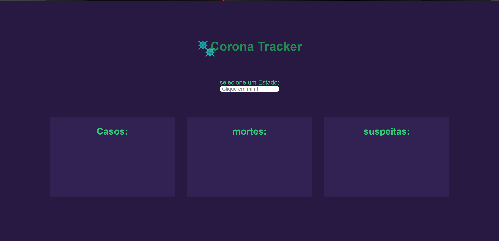
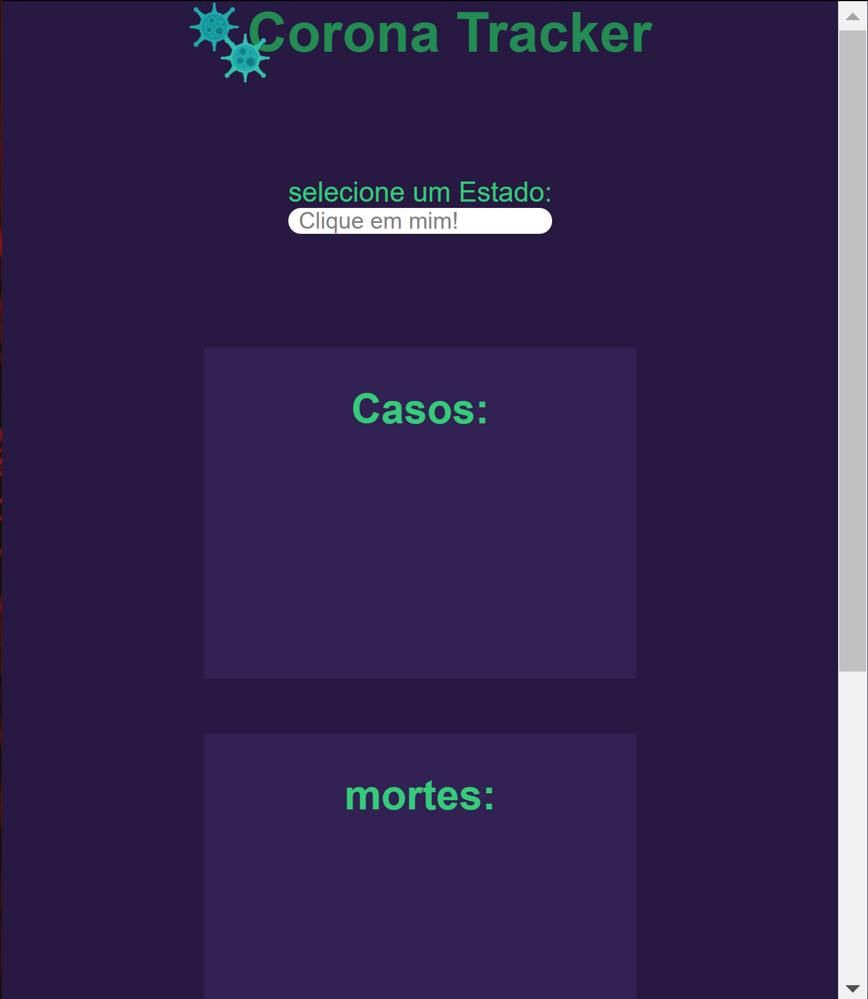

**CORONA TRACKER**

- [Projeto](#projeto)
- [introducao](#introducao)
- [ferramentas](#ferramentas)
- [novidades](#novidades)

----
### Projeto
> FullScreen

> Mobile

---
### introducao
Voce pode usar a area de section para buscar por um Estado do Brasil e ele mostrara o numero de casos, mortes e suspeitas em tempo real

----------

### ferramentas
1. HTML
2. CSS
3. javascript

----------

### novidades
foi a primeira vez que trabalhei com:
- Promisses
- Media Query
- Section
- API
- Repeticao com elementos
